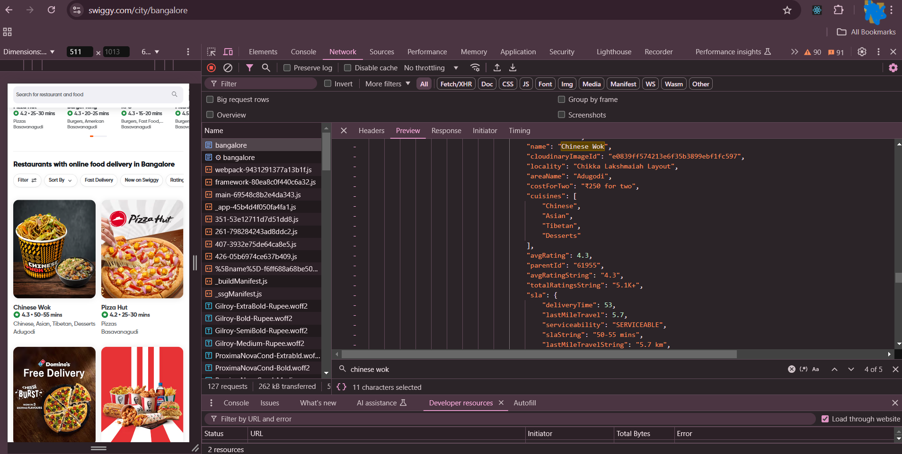
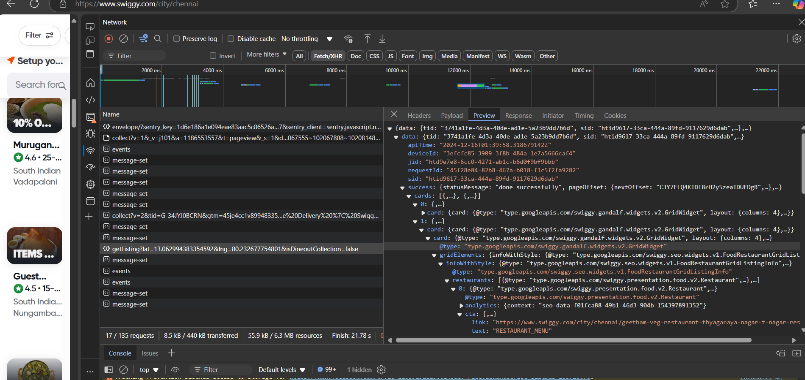

# Tasty-API Server

## Disclaimer:- I use [Swiggy](https://www.swiggy.com/) api data for Education purpose only.

## Swiggy people don't report me🥺

## Credits:- [https://www.swiggy.com/](https://www.swiggy.com/)

Why I and You Need this Tasty-API Sever?

Swiggy rapidly changes their API for their security purposes. Also it has [cors](https://developer.mozilla.org/en-US/docs/Web/HTTP/CORS) issues.

First they hide their data into file bangalore


and next other api calls they hide their data in header you can see in preview [https://www.swiggy.com/api/seo/getListing?lat=12.960059122809971&lng=77.57337538383284&isDineoutCollection=false]()


This server didn't contain all swiggy data only has two api data. it's enough for [Akshy Saini](https://www.linkedin.com/in/akshaymarch7/?originalSubdomain=in)'s [Namaste React Course]().

- we can take aproximately 25 x 8 = 200 restaurant name in this api by pages.

- but only one restuaran menu i have restaurant menu file is very big use that thing for all of your file Why Not.

i use [https://minify-js.com/](https://minify-js.com/) to minify the object file and put .prettireignore for that file

if github automatically expant that file minified yourself otherwise your machine will create noise

This Tasty-API Server (node js server) provide json for My [Namaste React Course](https://namastedev.com/learn/namaste-react) React app.

Here we go again like GTA San Andreas 😂.

## clone this Repository

Open new emty folder in your vs code run this command on terminal

```bash
  git clone "https://github.com/Praveen-BE/Tasty-Server.git"
```

navigate to project

```bash
  cd Tasty-Server
```

install dependencies

```bash
  npm install
```

for one time run (node index.js)

```bash
  npm run start
```

whenever you save and re-run (nodemon index.js)

```bash
  npm run dev
```

## localhost and cors

Go to the index.js

- You can change your backend port as you wish
- if your frontend url or port in diffent change in index.js for bypass cors

## NoSql database

- if you are familier with nosql database see folder "/jsonFiles" i put all json files here.
